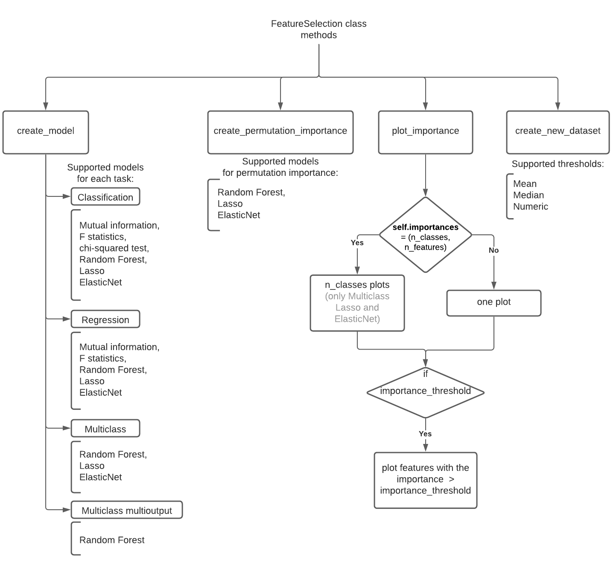

# Feature Engineering

```{eval-rst}
 .. autoclass:: insolver.feature_engineering.DataPreprocessing
    :show-inheritance: 
```
Class `DataPreprocessing` allows you to automatically preprocess your data. It supports such feature engineering functionality to transform data as Categorical data transform, AutoFill NA, Normalization, Feature Selection, Dimensionality Reduction, Smoothing, Sampling.

You can just call the method preprocess and it will normalize, fill in NA values and transform your data.

```python
import pandas as pd
from insolver.feature_engineering import DataPreprocessing

df = pd.DataFrame(...)
new_df = DataPreprocessing().preprocess(df=df, target='target')
```
Data must be [pandas.DataFrame](https://pandas.pydata.org/docs/reference/api/pandas.DataFrame.html) or insolver.InsolverDataFrame type.

You can also set selected columns as numerical or categorical:
```python
import pandas as pd
from insolver.feature_engineering import DataPreprocessing

df = pd.DataFrame(...)
new_df = DataPreprocessing(numerical_columns=['1', '2', '3'],
                  categorical_columns=['5']).preprocess(df = df, target='target')
```
If you want to use some of the functionality available in this class, but don't want to select a specific method, set the parameters to True and it will use the default values: 
```python
import pandas as pd
from insolver.feature_engineering import DataPreprocessing

df = pd.DataFrame(...)
preprocess = DataPreprocessing(normalization=True, fillna=True, sampling=True, transform_categorical=True)
new_df = preprocess.preprocess(df = df, target='target')
```
However, some functions need to have initialized parameters: 
```python
import pandas as pd
from insolver.feature_engineering import DataPreprocessing

df = pd.DataFrame(...)
preprocess = DataPreprocessing(feature_selection=True, feat_select_task='class', smoothing=True,
                           smoothing_column='smoothing_column')
new_df = preprocess.preprocess(df = df, target='target')
```
The `DataPreprocessing` class also supports the initialization of multiple targets, for this set the `target` parameter in the `no_name_func` method as a list: 
```python
import pandas as pd
from insolver.feature_engineering import DataPreprocessing

df = pd.DataFrame(...)
new_df = DataPreprocessing().preprocess(df = df, target=['target', 'target_2'])
```
You can also modify all functions by changing their parameters or by setting some of the default functions that are True to None/False:
```python
import pandas as pd
from insolver.feature_engineering import DataPreprocessing

df = pd.DataFrame(...)
preprocess = DataPreprocessing(transform_categorical=None,  normalization='minmax', fillna=True,
                           fillna_categorical='imputed_column', fillna_numerical='mode', sampling='cluster',
                           sampling_n=2, sampling_n_clusters=5, smoothing='moving_average',
                           smoothing_column='smoothing_column', feature_selection='lasso', feat_select_task='class',
                           feat_select_threshold='mean')
new_df = preprocess.preprocess(df = df, target='target')

dim_red_preprocess = DataPreprocessing(dim_red='isomap', dim_red_n_components=1, dim_red_n_neighbors=10)
dim_red_new_df = dim_red_preprocess.preprocess(df = df, target='target')
```

## Feature Selection

```{eval-rst}
 .. autoclass:: insolver.feature_engineering.FeatureSelection
    :show-inheritance: 
```
Class `FeatureSelection` allows you to compute features importances using the selected method. It also can plot it with the plot size chosen and the importance threshold. You can create a new dataset with the best features using computed importance. The permutation importance model inspection with some models also can be used.

Class `FeatureSelection` supports such tasks as classification, regression, multiclass classification, and multiclass multioutput classification.

The following  methods can be used for each task:
- for the `class` task, Mutual information, F statistics, chi-squared test, Random Forest, Lasso, or ElasticNet can be used;
- for the `reg` task, Mutual information, F statistics, Random Forest, Lasso, or ElasticNet can be used;
- for the `multiclass` task, Random Forest, Lasso or ElasticNet can be used;
- for the `multiclass_multioutput` classification Random Forest can be used.

Random Forest is used by default.

All the methods used in this class are from `scikit-learn`:  
- `random_forest`[classification model](https://scikit-learn.org/stable/modules/generated/sklearn.ensemble.RandomForestClassifier.html) / [regression model](https://scikit-learn.org/stable/modules/generated/sklearn.ensemble.RandomForestRegressor.html), 
- `lasso` [classification model](https://scikit-learn.org/stable/modules/generated/sklearn.linear_model.LogisticRegression.html) / [regression model](https://scikit-learn.org/stable/modules/generated/sklearn.linear_model.Lasso.html),
-  `elasticnet` [classification model](https://scikit-learn.org/stable/modules/generated/sklearn.linear_model.LogisticRegression.html) / [regression model](https://scikit-learn.org/stable/modules/generated/sklearn.linear_model.ElasticNet.html),
-  `mutual_inf` [classification information](https://scikit-learn.org/stable/modules/generated/sklearn.feature_selection.mutual_info_classif.html) / [regression information](https://scikit-learn.org/stable/modules/generated/sklearn.feature_selection.mutual_info_regression.html),
-  `f_statistic` [classification statistic](https://scikit-learn.org/stable/modules/generated/sklearn.feature_selection.f_classif.html) / [regression statistic](https://scikit-learn.org/stable/modules/generated/sklearn.feature_selection.f_regression.html),
-  `chi2` [classification statistic](https://scikit-learn.org/stable/modules/generated/sklearn.feature_selection.chi2.html).

[`Permutation feature importance`](https://scikit-learn.org/stable/modules/generated/sklearn.inspection.permutation_importance.html) technique is also from `scikit-learn`. It supports only [estimator](https://scikit-learn.org/stable/glossary.html#term-estimator) models: Random Forest, Lasso, and ElasticNet.

### Methods diagram



### Example

```python
import pandas as pd
from insolver.frame import InsolverDataFrame
from insolver.feature_engineering import FeatureSelection

# create dataset using InsolverDataFrame or pandas.DataFrame
dataset = InsolverDataFrame(pd.read_csv("..."))

# init class FeatureSelection with default method
fs = FeatureSelection(y_column='y_column', task='class')

# create model using create_model()
fs.create_model(dataset)

# plot created model importances using plot_importance()
fs.plot_importance()

# create permutation importance using create_permutation_importance()
fs.create_permutation_importance()

# create new dataset using create_new_dataset()
new_dataset = fs.create_new_dataset()

# you can also create permutation importance by setting parameter permutation_importance=True
fs_p = FeatureSelection(method='lasso', task='class', permutation_importance=True)
fs_p.create_model(dataset)
```
## Normalization

```{eval-rst}
.. autoclass:: insolver.feature_engineering.Normalization
    :show-inheritance:
```

Normalization can be defined as adjusting values measured on different scales to a notionally common scale, often prior to averaging. In more complicated cases, normalization can be defined as more sophisticated adjustments where the intention is to bring the entire probability distributions of adjusted values into alignment. Class `Normalization` implements seven methods for data normalization. 

You can select the method by changing the `method` parameter:
- `standard` - [StandardScaler](https://scikit-learn.org/stable/modules/generated/sklearn.preprocessing.StandardScaler.html) standardizes features by removing the mean and scaling to unit variance;
- `minmax` - [MinMaxScaler](https://scikit-learn.org/stable/modules/generated/sklearn.preprocessing.MinMaxScaler.html) transforms features by scaling each feature to a given range;
- `robust` - [RobustScaler](https://scikit-learn.org/stable/modules/generated/sklearn.preprocessing.RobustScaler.html) scales features using statistics that are robust to outliers;
- `normalizer` - [Normalizer](https://scikit-learn.org/stable/modules/generated/sklearn.preprocessing.Normalizer.html) normalizes samples individually to unit norm;
- `yeo-johnson` - [PowerTransformer(method='yeo-johnson')](https://scikit-learn.org/stable/modules/generated/sklearn.preprocessing.PowerTransformer.html) applies a power transform featurewise to make data more Gaussian-like, supports both positive or negative data;
- `box-cox` - [PowerTransformer(method='box-cox')](https://scikit-learn.org/stable/modules/generated/sklearn.preprocessing.PowerTransformer.html) applies a power transform featurewise to make data more Gaussian-like, requires input data to be strictly positive;
- `log` - logarithm of the values.

Only selected columns can be transformed using the `method` with the `column_names` parameter set to `str` or `list`.
You can also transform particular columns using the specified method for each column with the `column_method` parameter set to `dict` *{'column name': 'method'}*. If `column_method` is set and `method` is None, only columns from `column_method` will be transformed. Columns in `column_method` and `column_names` cannot be dublicated.
If `column_names` is None and `column_method` is also None, all columns will be transformed using the specified method.

`transform(data)` is the main normalization method. It creates new `pandas.DataFrame` as a copy of the original data and transformes either the selected or all columns.

You can also plot original and transformed data with the `plot_transformed(column, **kwargs)` method. It will plot old and new transformed selected `column`. You can set parameters for the [seaborn.displot](https://seaborn.pydata.org/generated/seaborn.displot.html) as **kwargs.

### Example

```python
import pandas as pd
from insolver.frame import InsolverDataFrame
from insolver.feature_engineering.normalization import Normalization

#create dataset using InsolverDataFrame or pandas.DataFrame
df = InsolverDataFrame(pd.read_csv("..."))

#create class instance with the selected method
norm = Normalization(method='standard', 
                     column_method={'column3':'minmax', 'Y_column': 'log'}, 
                     column_names=['column1', 'column2'])

#use transform() to create new dataframe
new_data = norm.transform(data = df)

#plot result
norm.plot_transformed(column = 'Y_column', kind="kde")

#set method=None to transform only columns from `column_method`
new_data = Normalization(method=None, 
                         column_method={'column3':'minmax', 'Y_column': 'log'}).transform(data = df)
```

## Dimensionality Reduction

```{eval-rst}
.. autoclass:: insolver.feature_engineering.DimensionalityReduction
    :show-inheritance:
```
    
`DimensionalityReduction` class allows you to reduce data dimensionality with a selected method. There are three types of techniques implemented: decomposition, manifold, and discriminant analysis.

The type of the method can be specified in the `method` parameter. The list of methods that can be assigned is presented below. All methods are implemented from [scikit-learn](https://scikit-learn.org/stable/index.html).

Matrix decomposition is represented by methods such as:
- `pca` - [Principal Component Analysis, PCA](https://scikit-learn.org/stable/modules/generated/sklearn.decomposition.PCA.html);
- `svd` - [truncated Singular Value Decomposition, SVD](https://scikit-learn.org/stable/modules/generated/sklearn.decomposition.TruncatedSVD.html);
- `fa` - [Factor Analysis, FA](https://scikit-learn.org/stable/modules/generated/sklearn.decomposition.FactorAnalysis.html);
- `nmf` - [Non-Negative Matrix Factorization, NMF](https://scikit-learn.org/stable/modules/generated/sklearn.decomposition.NMF.html).

Discriminant Analysis is represented by methods such as:
- `lda` - [Linear Discriminant Analysis, LDA](https://scikit-learn.org/stable/modules/generated/sklearn.discriminant_analysis.LinearDiscriminantAnalysis.html).

Manifold learning is represented by methods such as:
- `lle` - [Locally Linear Embedding, LLE](https://scikit-learn.org/stable/modules/generated/sklearn.manifold.LocallyLinearEmbedding.html);
- `isomap` - [Isomap Embedding](https://scikit-learn.org/stable/modules/generated/sklearn.manifold.Isomap.html);
- `t_sne` - [T-distributed Stochastic Neighbor Embedding, T-SNE](https://scikit-learn.org/stable/modules/generated/sklearn.manifold.TSNE.html).

Use the `transform(X, y=None, **kwargs)` method to create a new transformed X. Parameters assigned as `kwargs` can be used to change model(estimator) parameters which can be found in the sklearn pages above.

You can plot the transformed X and y with the `plot_transformed(self, y, figsize=(10,10), **kwargs)` method. It uses [seaborn](https://seaborn.pydata.org/) to create plots. If the number of components is less than 3, [seaborn.scatterplot](https://seaborn.pydata.org/generated/seaborn.scatterplot.html) will be created, else [seaborn.pairplot](https://seaborn.pydata.org/generated/seaborn.pairplot.html) will be created. The `y` parameter is used as the hue. Parameters assigned as `kwargs` can be used to change plot parameters found in the seaborn pages.

You can access created model with the `estimator` attribute.

### Example

```python
import pandas as pd
from insolver.feature_engineering import DimensionalityReduction

#create X and y
from sklearn import datasets

iris = datasets.load_iris()
X = iris.data
y = pd.DataFrame(iris.target, columns=['y'])

#create DimensionalityReduction
dm = DimensionalityReduction(method='nmf')

#use transform() to create new X
new_X = dm.transform(X=X, n_components=3)

#plot result
dm.plot_transformed(y, figsize=(5, 5), palette='Set2')
```

## Smoothing

```{eval-rst}
.. autoclass:: insolver.feature_engineering.Smoothing
    :show-inheritance:
```

Data smoothing can be defined as a statistical approach of eliminating outliers from datasets to make the patterns more noticeable. Class `Smoothing` implements four methods for data smoothing. 

You can select the method by changing the `method` parameter:
- `moving_average` is a calculation to analyze data points by creating a series of averages of different subsets of the full data set, uses [pandas.DataFrame.rolling()](https://pandas.pydata.org/docs/reference/api/pandas.DataFrame.rolling.html).mean() method;
- `lowess` - Locally Weighted Scatterplot Smoothing is a generalization of moving average and polynomial regression, uses [statsmodels.api.nonparametric.lowess](https://www.statsmodels.org/dev/generated/statsmodels.nonparametric.smoothers_lowess.lowess.html);
- `s_g_filter` - Savitzky–Golay filter is  achieved by fitting successive sub-sets of adjacent data points with a low-degree polynomial by the method of linear least squares, uses [scipy.signal.savgol_filter](https://docs.scipy.org/doc/scipy/reference/generated/scipy.signal.savgol_filter.html);
- `fft` - Fast Fourier transform  is an algorithm that computes the discrete Fourier transform (DFT) of a sequence, or its inverse (IDFT), uses [scipy.fft.rfft](https://docs.scipy.org/doc/scipy/reference/generated/scipy.fft.rfft.html) and [scipy.fft.irfft](https://docs.scipy.org/doc/scipy/reference/generated/scipy.fft.irfft.html).

`transform(data, **kwargs)` is the main smoothing method. It creates new `pandas.DataFrame` as a copy of original data and adds a new transformed column.

This class has parameters that are used for different methods:
- `window` - Window size for the `moving_average` and `s_g_filter` methods.
- `polyorder` - Polyorder for the `s_g_filter` method.
- `threshold` - Threshold for the `fft` method.

Other parameters that are used for each method (besides `fft`) can be passed as `kwargs` to the `transform(data, **kwargs)` method.

You can also plot original and transformed data with the `plot_transformed(figsize=(7, 7))` method.

### Example

```python
import pandas as pd
from insolver.frame import InsolverDataFrame
from insolver.feature_engineering import Smoothing

#create dataset using InsolverDataFrame or pandas.DataFrame
df = InsolverDataFrame(pd.read_csv("..."))

#create class instance with the selected method
smoothing = Smoothing(method='fft', x_column='x')

#use transform() to create new dataframe
new_data = smoothing.transform(data=df)

#plot result
smoothing.plot_transformed(figsize=(10,10))
```

## Sampling

```{eval-rst}
.. autoclass:: insolver.feature_engineering.Sampling
    :show-inheritance:
```

Sampling is the selection of a subset (a statistical sample) of individuals from within a statistical population to estimate characteristics of the whole population.
Class `Sampling` implements methods from __probability sampling__. A probability sample is a sample in which every unit in the population has a chance (greater than zero) of being selected in the sample, and this probability can be accurately determined.
There are four methods you can use by changing the `method` parameter:
- `simple` (default) sampling is a technique in which a subset is randomly selected number from a set;
- `systematic` sampling is a technique in which a subset is selected from a set using a defined step;
- `cluster` sampling is a technique in which a set is divided into clusters, then the set is determined by a randomly selected number of clusters; 
- `stratified` sampling is a technique in which a set is divided into clusters, then the set is determined by a randomly selected number of units from each cluster.

The `n` parameter is used differently in each sampling method:
- for a `simple` sampling, `n` is the number of values to keep;
- for a `systematic` sampling, `n` is the number of step size;
- for a `cluster` sampling, `n` is the number of clusters to keep;
- for a `stratified` sampling, `n` is the number of values to keep in each cluster.

You can use the dataframe column as clusters by defining `cluster_column`. It will use values from this column in `cluster` and `stratified` methods.

### Example

```python
import pandas as pd
from insolver import InsolverDataFrame
from insolver.feature_engineering import Sampling

#create dataset using InsolverDataFrame or pandas.DataFrame
dataset = InsolverDataFrame(pd.read_csv("..."))

#create class instance with the selected sampling method
sampling = Sampling(n=10, n_clusters=5, method='stratified')

#use method sample_dataset() to create new dataframe
new_dataset = sampling.sample_dataset(df=dataset)

#using dataframe column as clusters
samling = Sampling(n = 2, cluster_column = 'name', method='stratified')
new_dataset = sampling.sample_dataset(df=dataset)
```
