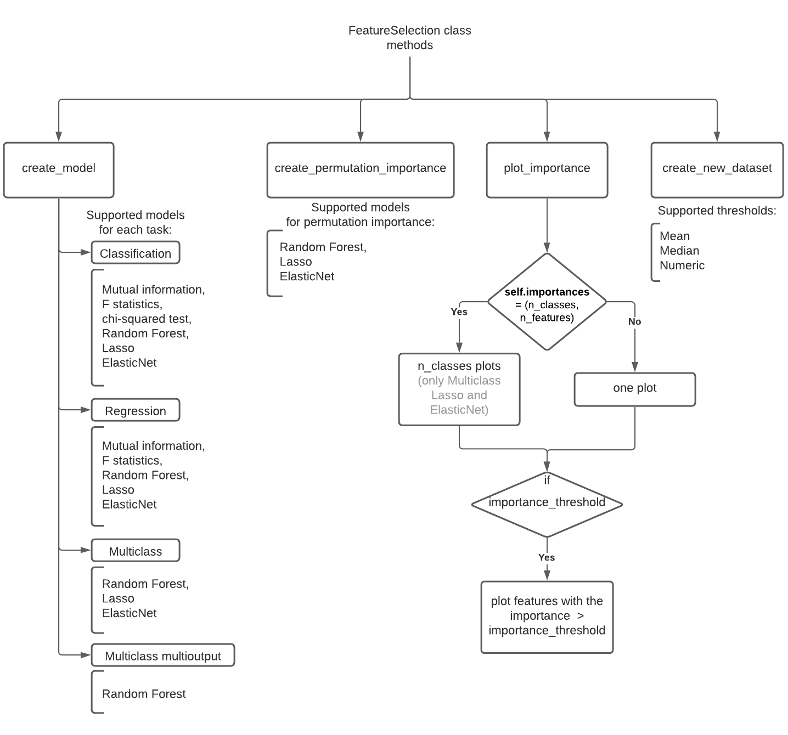

# Feature Selection

.. autoclass:: insolver.selection.FeatureSelection
    :show-inheritance:

Class `FeatureSelection` allows you to compute features importances using selected method. It also can plot it with selected plot size and the importance threshold. Using computed importance you can create a new dataset with the best features. You can also use permutation importance model inspection technique with some models.

Class `FeatureSelection` supports such tasks as classification, regression, multiclass classification and multiclass multioutput classification.

The following  methods can be used for each individual task:
- for the `class` task Mutual information, F statistics, chi-squared test, Random Forest, Lasso or ElasticNet can be used;
- for the `reg` task Mutual information, F statistics, Random Forest, Lasso or ElasticNet can be used;
- for the `multiclass` task Random Forest, Lasso or ElasticNet can be used;
- for the `multiclass_multioutput` classification Random Forest can be used.

Random Forest is used by default.

All the methods used in this class are from `scikit-learn`:  
- `random_forest`[classification model](https://scikit-learn.org/stable/modules/generated/sklearn.ensemble.RandomForestClassifier.html) / [regression model](https://scikit-learn.org/stable/modules/generated/sklearn.ensemble.RandomForestRegressor.html), 
- `lasso` [classification model](https://scikit-learn.org/stable/modules/generated/sklearn.linear_model.LogisticRegression.html) / [regression model](https://scikit-learn.org/stable/modules/generated/sklearn.linear_model.Lasso.html),
-  `elasticnet` [classification model](https://scikit-learn.org/stable/modules/generated/sklearn.linear_model.LogisticRegression.html) / [regression model](https://scikit-learn.org/stable/modules/generated/sklearn.linear_model.ElasticNet.html),
-  `mutual_inf` [classification information](https://scikit-learn.org/stable/modules/generated/sklearn.feature_selection.mutual_info_classif.html) / [regression information](https://scikit-learn.org/stable/modules/generated/sklearn.feature_selection.mutual_info_regression.html),
-  `f_statistic` [classification statistic](https://scikit-learn.org/stable/modules/generated/sklearn.feature_selection.f_classif.html) / [regression statistic](https://scikit-learn.org/stable/modules/generated/sklearn.feature_selection.f_regression.html),
-  `chi2` [classification statistic](https://scikit-learn.org/stable/modules/generated/sklearn.feature_selection.chi2.html).

[`Permutation feature importance`](https://scikit-learn.org/stable/modules/generated/sklearn.inspection.permutation_importance.html) technique is also from `scikit-learn`. It supports only [estimator](https://scikit-learn.org/stable/glossary.html#term-estimator) models: Random Forest, Lasso and ElasticNet.

## Methods diagram



## Example

```python
import pandas as pd
from insolver.frame import InsolverDataFrame
from insolver.selection import FeatureSelection

#create dataset using InsolverDataFrame or pandas.DataFrame
dataset = InsolverDataFrame(pd.read_csv("..."))

#init class FeatureSelection with default method
fs = FeatureSelection(y_column='y_column', task='class')

#create model using create_model()
fs.create_model(dataset)

#plot created model importances using plot_importance()
fs.plot_importance()

#create permutation importance using create_permutation_importance()
fs.create_permutation_importance()

#create new dataset using create_new_dataset()
new_dataset = fs.create_new_dataset()

#you can also create permutation importance by setting parameter permutation_importance=True
fs_p = FeatureSelection(method='lasso', task='class', permutation_importance=True)
fs_p.create_model(dataset)
```