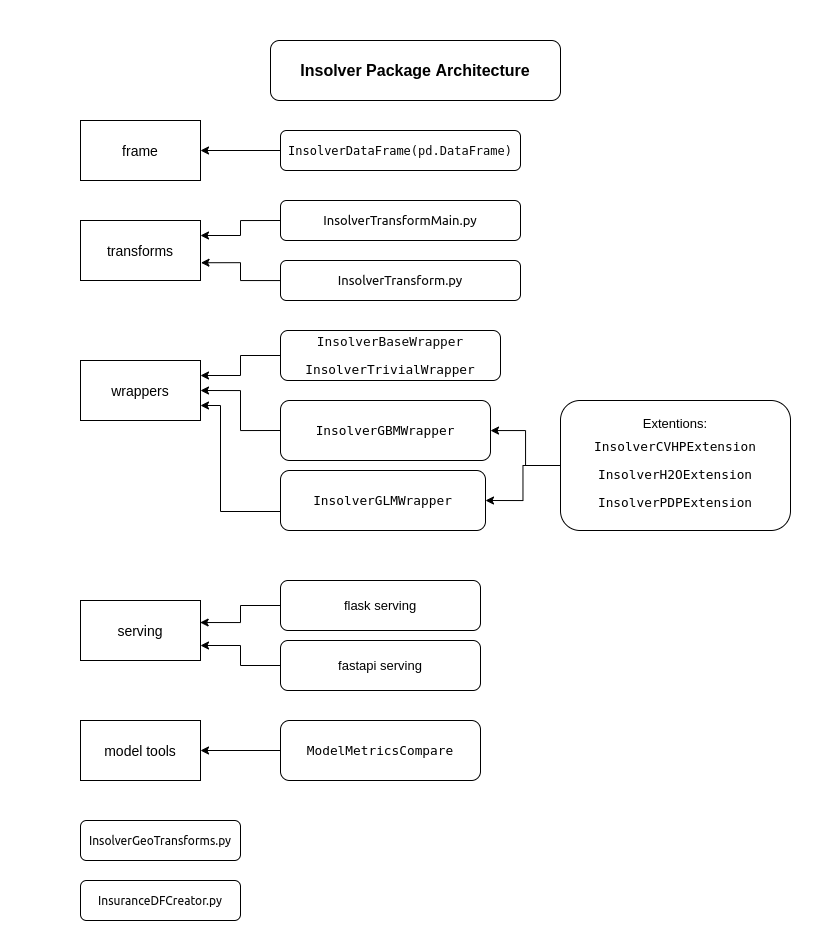

# Package Architecture

Insolver package consists of several modules:

- InsolverDataFrame and various transformations make it easy to operate with data.
- Wrappers and models tools help build and evaluate ML models.
- Service module allows to launch a simple API server with a saved ML model.

More detailed information on the modules of insolver package can be found in [API References](api_ref.md).
